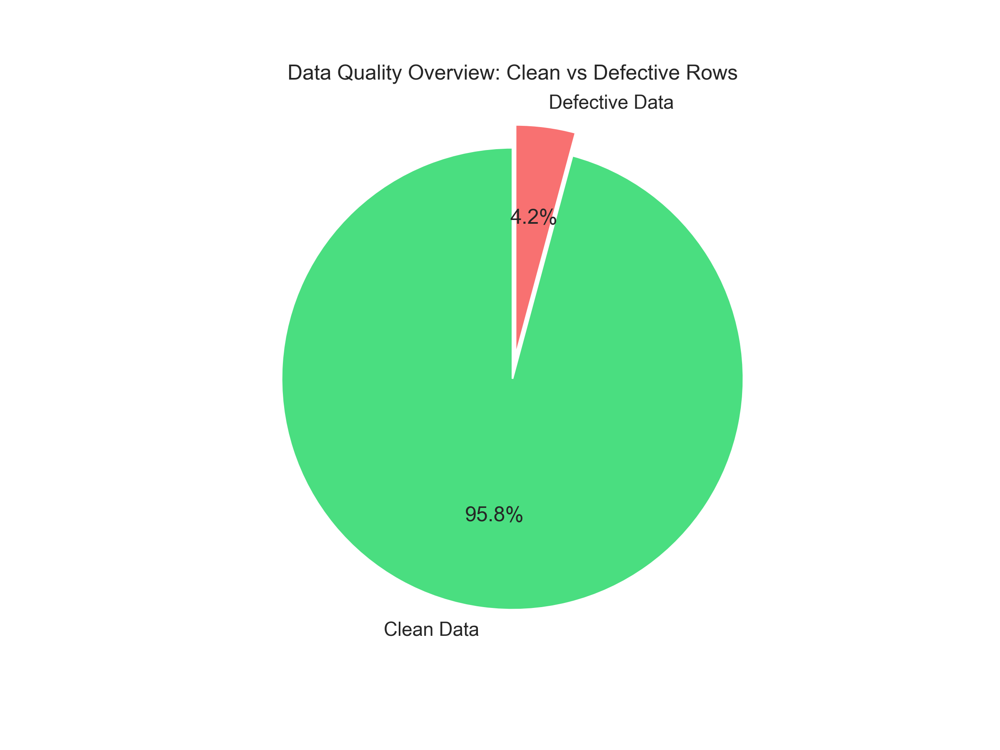
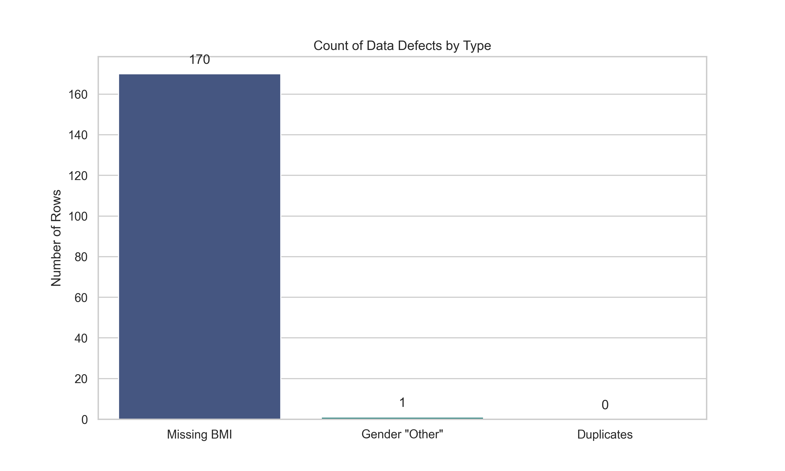

# 🛡️ Data Quality Audit Report

This document details the data quality issues found in the raw dataset and the actions taken to resolve them.

## 1. Executive Summary
- **Total Rows Analyzed:** 4088
- **Clean Rows:** 3917 (95.8%)
- **Defective Rows:** 171 (4.2%)

## 2. Defect Breakdown
We identified the following specific issues:

| Defect Type | Count | Percentage | Impact | Action Taken |
|-------------|-------|------------|--------|--------------|
| **Missing BMI** | 170 | 4.2% | Critical Feature Missing | **Imputed** using KNN (k=5) |
| **Gender 'Other'** | 1 | 0.0% | Inconsistent Category | **Dropped** (Sample size too small) |
| **Duplicates** | 0 | 0.0% | Data Leakage Risk | **Dropped** |

## 3. Resolution Strategy
### A. Missing BMI (Imputation)
Instead of dropping 4% of our data (which is significant), we used **KNN Imputation**. This algorithm finds the 5 most similar patients (based on Age, Glucose, etc.) and uses their average BMI to fill the gap. This preserves statistical integrity.

### B. Gender 'Other' (Dropping)
With only 1 occurrence, the 'Other' category provides insufficient statistical power for the model to learn anything meaningful. Dropping it prevents noise.
