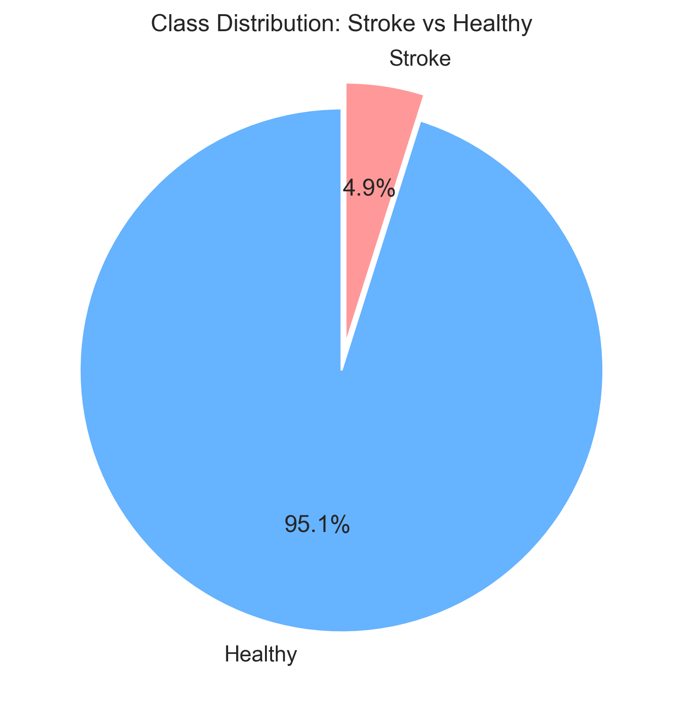
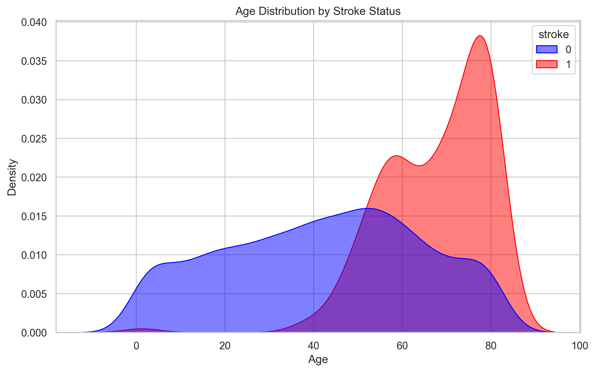
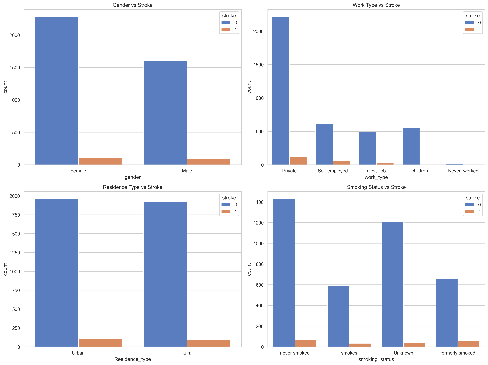
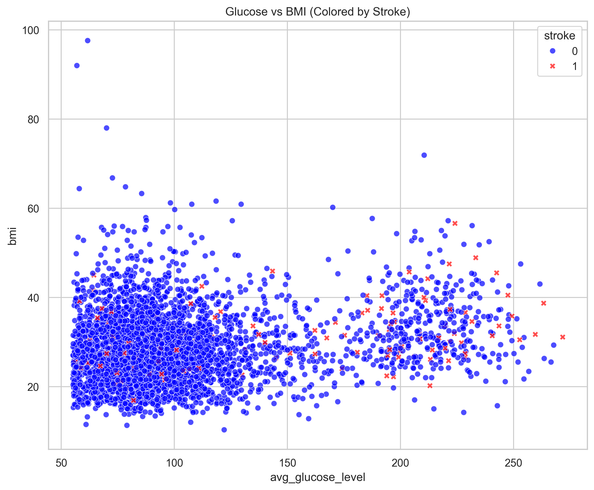
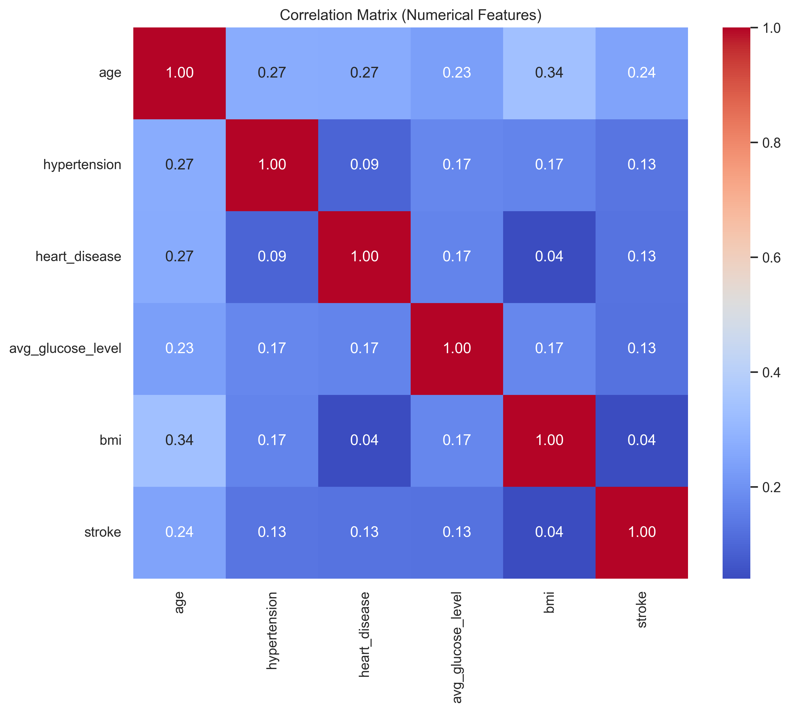

# 📊 Exploratory Data Analysis (EDA) Report

This document provides a visual analysis of the **Stroke Prediction Dataset**. These insights guided our modeling strategy, particularly the decision to use **SMOTE** for handling class imbalance and **KNN Imputation** for missing values.

---

## 1. Class Imbalance (Target Distribution)

**Observation:**
The dataset is **highly imbalanced**, with Stroke cases representing a very small minority (approx. 5%) compared to Healthy cases.

**Impact on Modeling:**
- A standard model would achieve 95% accuracy by simply predicting "Healthy" for everyone, which is useless.
- **Solution:** We implemented **SMOTE (Synthetic Minority Over-sampling Technique)** to generate synthetic examples of stroke cases during training, forcing the model to learn the characteristics of the minority class.

---

## 2. Age Distribution by Stroke Status

**Observation:**
- **Healthy (Blue):** Distributed across all ages, with a peak in younger/middle ages.
- **Stroke (Red):** Strongly skewed towards older ages (60+).

**Insight:**
Age is the **single most significant predictor** of stroke risk. The probability density for stroke spikes dramatically after age 55. This justifies our "Smart Prediction" logic where we lower the risk threshold for elderly patients.

---

## 3. Categorical Risk Factors

**Observations:**
- **Gender:** Stroke risk appears relatively balanced between genders, though slightly higher in absolute numbers for females due to longevity.
- **Work Type:** "Self-employed" and "Private" sector workers show higher stroke counts, likely correlated with age and stress. "Children" have near-zero risk.
- **Residence:** Urban vs. Rural residence shows little difference, suggesting environment is a weaker predictor than physiology.
- **Smoking:** "Formerly smoked" and "Smokes" categories have a higher proportion of stroke cases compared to "Never smoked", confirming smoking as a key lifestyle risk factor.

---

## 4. Physiology: Glucose vs. BMI

**Observation:**
- **Cluster Analysis:** We see a distinct cluster of Stroke cases (Red dots) in the region of **High Glucose (> 200)** and **High BMI (> 30)**.
- **Outliers:** There are stroke cases even with normal BMI, but they almost always have high glucose or advanced age.

**Insight:**
The combination of Obesity (High BMI) and Diabetes (High Glucose) creates a "Compound Risk" effect. Our model captures this non-linear interaction.

---

## 5. Correlation Matrix

**Observation:**
- **Age** has the strongest positive correlation with **Stroke**, **Hypertension**, and **Heart Disease**.
- **BMI** has a moderate correlation with **Age**, but a weaker direct correlation with Stroke than expected (likely because high BMI is a long-term driver of hypertension, which *then* causes stroke).
- **Glucose** shows a positive correlation with Stroke.

**Conclusion:**
Multicollinearity is present (e.g., Age vs. Hypertension), but tree-based models like **Random Forest** handle this well. The strong correlation of Age confirms it as the dominant feature.
